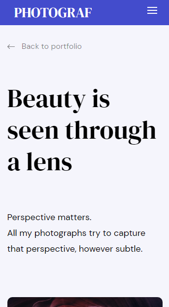
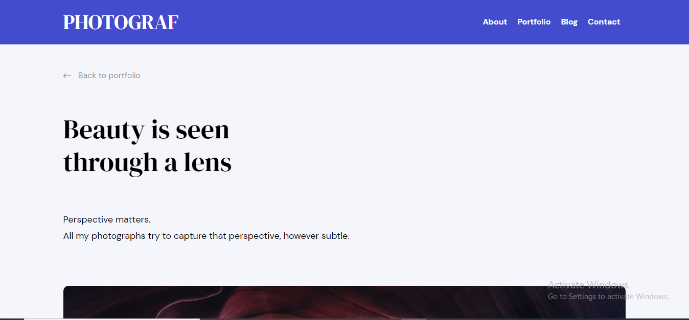

# **Photograph Landing Page**

<div align="center">
  <h3>
    <a href="https://github.com/Tanosimboangy/front-end-finals" target="_blank">
      Source
    </a>
    <span> | </span>
    <a href="https://jacquit-photograph.netlify.app/" target="_blank">
      Demo
    </a>
  </h3>
</div>

## **Built With**
- __<span><a href="https://developer.mozilla.org/en-US/docs/Glossary/HTML5" target="_blank">HTML5</a></span>.__
- __<span><a href="https://sass-lang.com/" target="_blank">SASS</a></span>.__
- __<span><a href="https://developer.mozilla.org/en-US/docs/Glossary/Javascript" target="_blank">Vanilla JavaScript</a></span>.__

## **Design**



## **Prerequisites:**

**To clone and run this application, you'll need <a href="https://git-scm.com/" target="_blank">Git</a> and <a href="https://nodejs.org/en/download/" target="_blank">Node.js</a> (which comes with <a href="https://www.npmjs.com/" target="_blank">npm</a>) installed on your computer.**

**These are the steps you can follow:**

```bash
# Clone this repository to your local machine
$ git clone https://github.com/Tanosimboangy/Photography-landing-page.git.

# Install dependencies:
- npm install

# Run the app
$ npm start

# Figma link:
You can find the desing online at: href="https://www.figma.com/file/VgF87mULloYb7HZ1EMCRzU/Laaqiq-1---Portfolio-detail-(Responsive)?node-id=7%3A16"


```
